# P0 Canvas Asset Data Flow Root Cause

## Current Symptoms

The `/create` canvas can show legacy recovery states such as "needs recovery", `recoveryStatus`, missing `storageKey`, and copy URL actions while the real image or video still does not render. The dangerous failure mode is not the status label; it is that generated media can exist only as a provider URL or browser/local canvas state without a durable `Asset.storageKey` and without `CanvasNode.metadataJson.assetId`.

## Real Data Flow

```mermaid
flowchart LR
  User["User clicks generate"] --> Frontend["VisualCanvasWorkspace.callGenerationApi"]
  Frontend --> Backend["/api/generate/image or /api/generate/video"]
  Backend --> Provider["Real provider adapter"]
  Provider --> Job["GenerationJob"]
  Provider --> Persist["persistGeneratedMedia"]
  Persist --> Storage["Supabase/OSS/COS storageKey"]
  Persist --> Asset["Asset row"]
  Asset --> Node["Canvas node metadata assetId"]
  Node --> Save["PUT /api/projects/:projectId/canvas"]
  Save --> DB["CanvasWorkflow/CanvasNode/CanvasEdge"]
  DB --> Load["GET /api/projects/:projectId/canvas"]
  Load --> Resolve["POST /api/assets/resolve-batch"]
  Resolve --> Media["img/video src resolvedUrl"]
```



## External API To Canvas Path

- Frontend submit: `apps/web/src/components/create/VisualCanvasWorkspace.tsx`, `callGenerationApi`.
- Image backend: `apps/web/src/app/api/generate/image/route.ts`, `POST`.
- Video backend: `apps/web/src/app/api/generate/video/route.ts`, `POST`.
- Seedance status backend: `apps/web/src/app/api/generate/video/status/route.ts`, `GET`.
- Provider calls: `apps/web/src/lib/providers/china/volcengine.ts`, `generateSeedreamImage`, `generateSeedanceVideo`, `getSeedanceVideoStatus`; generic gateway uses `apps/web/src/lib/providers/generate.ts`.
- Persistence: `apps/web/src/lib/assets/persist-generated-media.ts`, `persistGeneratedMedia`.
- Storage adapter: `apps/web/src/lib/assets/storage-adapter.ts`, `uploadAsset`, `resolveAssetUrl`, `checkObjectExists`, `downloadExternalAsset`.

## Canvas Save Location

Stable canvas persistence is the database:

- `CanvasWorkflow`
- `CanvasNode`
- `CanvasEdge`

The API is `apps/web/src/app/api/projects/[projectId]/canvas/route.ts`.

Local storage is a fallback/cache, not the durable source:

- `creator-city:canvas-snapshot:<projectId>`
- `creator-city:canvas-cache:<projectId>`
- `creator-city:draft:<projectId>`
- `creator-city:last-project-id`
- `creator-city:last-workflow-id`

## Canvas Read Location

The page loads from `GET /api/projects/:projectId/canvas` or `POST /api/projects/ensure?includeCanvas=1`, then maps DB rows through `apps/web/src/lib/projects/canvas-mappers.ts`.

`mapCanvasNode` reads `metadataJson.assetId` and `metadataJson.mediaPersistence.assetId` into the runtime node `assetId`.

## Asset Save Location

Durable assets are rows in `Asset` with:

- `storageProvider`
- `bucket`
- `storageKey`
- `url`
- `originalUrl`
- `providerJobId`
- `generationJobId`
- `recoveryStatus`

The object bytes live in the configured storage adapter. In production this must be Supabase Storage, Aliyun OSS, or Tencent COS. `local_dev` and `/public/generated` are local-only fallback paths and are not production-safe.

## Frontend Asset Resolution

`VisualCanvasWorkspace` collects media-node asset IDs and calls `POST /api/assets/resolve-batch`. The resolver lives in `apps/web/src/lib/assets/asset-resolver.ts`. Ready results patch runtime nodes with `resolvedUrl`, and `CanvasNodeCard` renders `resultImageUrl` or `resultVideoUrl`.

## Broken Links Found

1. Video generation did not consistently pass completed media through `persistGeneratedMedia`.
2. Seedance async submit returned a provider `taskId` but did not create a durable `GenerationJob` row for the canvas chain.
3. The fallback project asset API, `POST /api/projects/:projectId/assets`, created media Asset rows from raw URLs without downloading/uploading them, so many Assets could have no `storageKey`.
4. Frontend fallback `createGeneratedAsset` posted to the backend but discarded the returned Asset, so `CanvasNode.metadataJson.assetId` could remain empty.
5. Local draft restore currently prefers any non-empty local canvas candidate; if local cache is stale and has URLs without asset IDs, it can mask a server canvas with more stable data until synced.

## Why It Got Worse

Recent changes added recovery UI and recovery statuses around an incomplete chain. That exposed missing `assetId`/`storageKey` but did not guarantee that every new generated media result became:

`provider URL -> downloaded bytes -> object storage -> Asset.storageKey -> CanvasNode.assetId -> persisted canvas`.

When a provider URL expired, the UI could only report that it was unrecoverable.

## Minimal Fix In This Change

1. `persistGeneratedMedia` now best-effort links the created Asset back to `GenerationJob.outputAssetId`.
2. `/api/generate/video` now creates a `GenerationJob` for Seedance, records `providerJobId`, persists synchronous video results, and persists generic video results when the provider returns a final URL.
3. `/api/generate/video/status` now finds the Seedance `GenerationJob`, persists completed video bytes, and returns `assetId`/stable URL metadata.
4. `/api/projects/:projectId/assets` now routes image/video HTTP URLs through `persistGeneratedMedia` instead of only saving the URL.
5. `VisualCanvasWorkspace.createGeneratedAsset` now patches the node with returned `assetId`, storage metadata, stable URL, local snapshot, and canvas save.
6. Added `scripts/trace-creator-city-data-flow.ts` and `scripts/export-current-creator-city-state.ts`.

## Do Not Touch

- Do not delete CanvasNode, CanvasEdge, Project, Asset, or GenerationJob rows.
- Do not clear localStorage, database tables, or storage buckets.
- Do not replace `/create` or change the product flow.
- Do not use mock media as a recovery result.
- Do not treat `blob:`, `/tmp`, `public/generated`, provider signed URLs, or `data:` as durable paid asset storage in production.

## Local Verification

Run:

```bash
cd /Users/aaron/creator-city && pnpm install
cd /Users/aaron/creator-city && pnpm lint
cd /Users/aaron/creator-city && pnpm typecheck
cd /Users/aaron/creator-city && pnpm build
cd /Users/aaron/creator-city && pnpm dlx tsx scripts/trace-creator-city-data-flow.ts
cd /Users/aaron/creator-city && pnpm dlx tsx scripts/audit-assets.ts
cd /Users/aaron/creator-city && pnpm dlx tsx scripts/recover-assets.ts
cd /Users/aaron/creator-city && pnpm dlx tsx scripts/backfill-canvas-asset-ids.ts
```

Note: the local database visible during this audit was empty, so production verification must run against Vercel/Supabase environment variables.

## Vercel Verification

After deploying the latest commit:

1. Confirm the Production deployment commit equals the pushed commit.
2. Open `https://creator-city-vert.vercel.app/create`.
3. Confirm old canvas nodes still exist.
4. Confirm old nodes with valid `assetId` render through `resolve-batch`.
5. Confirm unrecoverable nodes show a concrete reason.
6. Generate a new image and verify it creates an Asset with `storageKey`.
7. Generate a new video and verify it creates a GenerationJob and Asset with `storageKey`.
8. Refresh, close/reopen, and redeploy; media should still render by `assetId`.

## Prevention Rules

- Every media generation route must either return an `assetId` or a concrete persistence failure.
- Every media Asset must prefer durable `storageKey` over provider URL.
- Every generated media CanvasNode must save `metadataJson.assetId`.
- Every page load must resolve media by `assetId` before using legacy URLs.
- Any recovery UI must be backed by a real storage/Asset/Canvas mutation or remain read-only diagnostics.
